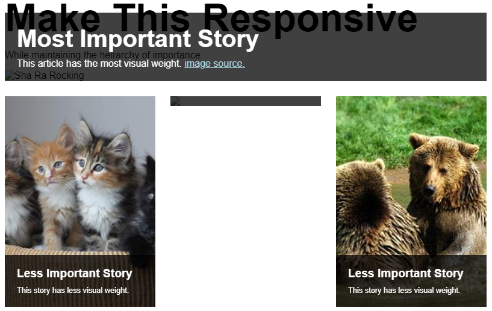

## Make it Responsive

Responsive designs have now become an industry standard. No one likes a website that they can't view on their phones or tablets. Many a times, you will find yourself with a design that has been made with a single screen size in mind, but has to be made responsive. Doing this involves a standard set of changes which, if made, can easily give you a perfectly responsive and fluid design. This is what you'll be doing for this task. 

[Here's a design](https://codepen.io/jain_shreyans/pen/mddjmwa)

Its made for an 800px wide screen. Do your best at making it responsive. After you are done, the design should look good on any screen size (almost :wink:). 

The design looks something like this in its current form:

