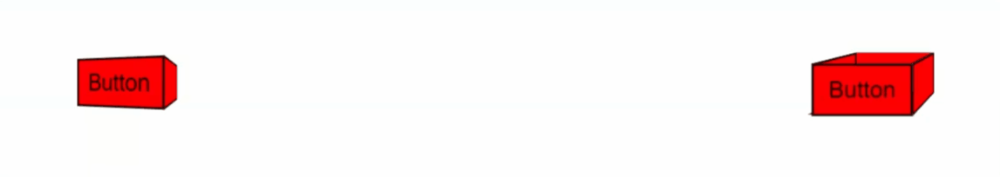

## 3D buttons

Create the following 3D buttons using only CSS3 transforms and transitions. The above image has the two buttons in normal state. The images below are the hover states. 

The animations must be realistic. The left one is like a light switch (but rotated 90deg) and the right one is of a box being squished open. Refer to the animation below.

