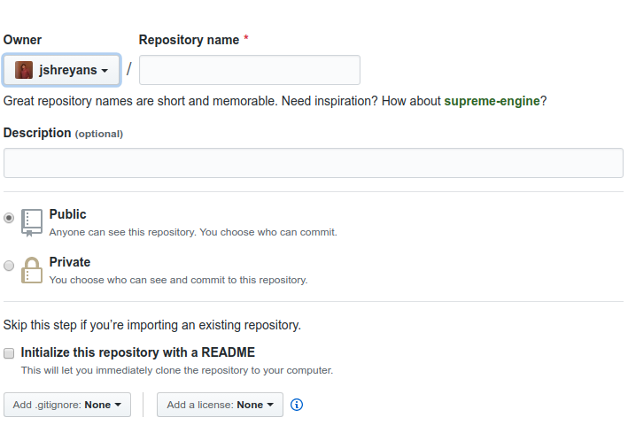

# Instruction Set 01
## Setup your repository

* Create a GitHub repository under your account with the name `frontend-101`. 
* While creating the repo, initialise it with a README file. You will see the option when creating the repo as in the image below:


* Add all of the below usernames to your repo’s collaborators:
    - jshreyans
    - mukul0596
    - meliodas113
    - chirag-singhal
    - Akshit-Patel
* On your repo page, create a Project board. More about this in the next instruction set.
* Congratulations!:clap: 
Your repo setup is complete. You can now proceed to [Instruction Set-2]((https://github.com/jshreyans/frontend-101-sheets/blob/master/instruction-set-02.md)).
* After all your tasks are complete. your repo's directory structure should look something like this:
```
    frontend-101
    |---A
        |-- 1.html
        |-- 2.html
        |-- 3.html
        |-- 4.html
        |-- 5.html
        |-- 6.html
        |-- 7.html
    |---B
        |-- 1.html
        |-- 2.html
        |-- 3.html
        |-- 4.html
        |-- 5.html
        |-- 6.html
        |-- 7.html
```