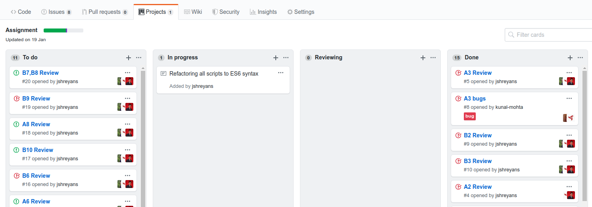

# Instruction Set 02
## General Workflow 

Project Boards are a utility to maintain and plan projects on which multile people can collaborate. Each project board contains columns for different categories of work and each column contains tasks/milestones. 

You will be creating a similar project board for frontend-101
1. Go to your repo page and from the top bar, select “Projects”
2. Create a new Project and give it a name – either Winter Assignment or frontend101, anything appropriate works.
3. Once inside the project, create 3 columns – To do, In Review, Completed
4. Your project board should now look something like this: 

5. Everytime you complete a task, create an issue. Give a title in the format `taskCode - title`. For eg, `A3-Trippy Grid`. Providing a short description of the logic used for the Javascript tasks would be a plus. 
6. On the side, you will find a menu which contains options like `Assignees` and `Projects`. Assign the issue to all the 2nd years and select the project you created in the Projects option so that we can view it on the board.
7. **Remember** - a task will be marked as completed only when one of us closes the corresponding issue. So don’t forget to create your issues!